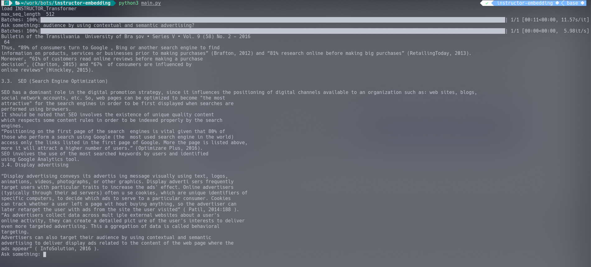

# Command-Line Chatbot for Question Answering

This is a question-answering chatbot from a command line. It makes use of Langchain, FAISS, and Instructor as embedding models.

You can find the instructions or documentation at the following link: https://instructor-embedding.github.io/
```bibtex
@inproceedings{INSTRUCTOR,
  title={One Embedder, Any Task: Instruction-Finetuned Text Embeddings},
  author={Su, Hongjin and Shi, Weijia and Kasai, Jungo and Wang, Yizhong and Hu, Yushi and  Ostendorf, Mari and Yih, Wen-tau and Smith, Noah A. and  Zettlemoyer, Luke and Yu, Tao},
  url={https://arxiv.org/abs/2212.09741},
  year={2022},
}
```
FAISS: https://github.com/facebookresearch/faiss

LangChain: https://python.langchain.com/docs/get_started/introduction

# Set up
To set up, first create your virtual environment and install all the requirements listed in the requirements.txt file.

# Use Your Pdf
You can specify your desired PDF file in the main.py on line 11.

# Visual


---

